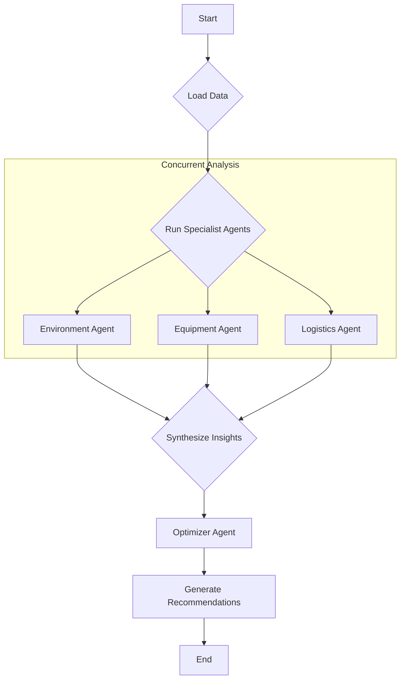

# Mining-chain

Sistem berbasis agen untuk menganalisis dan mengoptimalkan operasi rantai nilai pertambangan. Proyek ini menggunakan pendekatan multi-agen untuk mensimulasikan dan merekomendasikan tindakan berdasarkan berbagai aliran data operasional.

## Workflow

Sistem ini diorkestrasi oleh `MiningOperationManager`, yang mengikuti langkah-langkah berikut:

1. **Memuat Data**: Memuat semua data perkiraan cuaca dan data operasional yang diperlukan dari direktori `/data/Dataset/Raw_Data`.
2. **Analisis Bersamaan**: Menjalankan tiga agen spesialis secara bersamaan untuk menganalisis berbagai aspek operasi:

   * **Environment Agent**: Menganalisis data cuaca dan kondisi jalan.
   * **Equipment Agent**: Menganalisis data operasional alat berat.
   * **Logistics Agent**: Menganalisis jadwal kapal dan data logistik.
3. **Optimasi**: Insight dari agen spesialis dikirim ke **Optimizer Agent**, yang menyintesis informasi, menghasilkan rekomendasi, dan membuat draft rencana operasional mingguan.


Diagram alur kerjanya:



##  Folder Structye

Ikhtisar folder penting dalam proyek ini:

* `/.gitattributes`, `/.gitignore`, `/.python-version`, `/uv.lock`: File konfigurasi git dan lingkungan Python.
* `/main.py`: Titik masuk utama proyek.
* `/pyproject.toml`, `/requirements.txt`: Dependencies dan metadata proyek.
* `/test_import.py`: Script untuk menguji import modul.
* `/data/Dataset/Raw_Data/`: Berisi dataset CSV mentah untuk berbagai aspek operasi seperti peralatan, logistik, produksi, dll. Terdapat file `Readme.md` di dalam folder ini yang menjelaskan masing-masing dataset dan atributnya.
* `/mining_agents/`: Logika inti aplikasi.

  * `main.py`: Titik masuk utama untuk menjalankan sistem agen.
  * `manager.py`: Orkestrator utama yang mengelola alur data dan eksekusi agen.
  * `data_loader.py`: Script untuk memuat dan memproses data bagi agen.
  * `/mining_agents_core/`: Berisi definisi agen individu:

    * `environment_agent.py`
    * `equipment_agent.py`
    * `logistics_agent.py`
    * `optimizer_agent.py`
* `/models/`: Berisi model machine learning pre-trained (`.pkl`) yang digunakan agen untuk prediksi dan penilaian.
* `/models_ml/`:

  * `train.py`: Script untuk melatih model machine learning dari data mentah.

## ⚙️ Setup dan Instalasi

Proyek ini menggunakan `uv` untuk manajemen lingkungan dan paket.

1. **Install uv**:
   Jika belum terpasang, ikuti panduan resmi:

   ```bash
   # macOS / Linux:
   curl -LsSf https://astral.sh/uv/install.sh | sh

   # Windows:
   powershell -c "irm https://astral.sh/uv/install.ps1 | iex"
   ```

2. **Buat Virtual Environment**:

   ```bash
   uv venv
   ```

3. **Aktifkan Environment**:

   * **Windows (PowerShell)**:

     ```powershell
     .venv\Scripts\Activate.ps1
     ```
   * **macOS/Linux (bash/zsh)**:

     ```bash
     source .venv/bin/activate
     ```

4. **Install Dependencies**:

   ```bash
   uv pip install -r requirements.txt
   ```
   or

   ```bash
   uv add -r requirements.txt
   ```

6. **Setup File `.env` untuk OpenAI**:
   Buat file `.env` di root proyek dan isi dengan:

   ```env
   OPENAI_API_KEY=your_openai_api_key
   OPENAI_MODEL_NAME=gpt-4
   ```

   > Ganti `your_openai_api_key` dengan API key OpenAI Anda dan `gpt-4` dengan model yang ingin digunakan.

7. **Load Variabel Lingkungan di Python**:
   Pastikan agen bisa membaca `.env` menggunakan `python-dotenv`:

   ```python
   from dotenv import load_dotenv
   import os

   load_dotenv()
   OPENAI_API_KEY = os.getenv("OPENAI_API_KEY")
   MODEL_NAME = os.getenv("OPENAI_MODEL_NAME")
   ```

## ▶ Cara Menjalankan Proyek

### Menggunakan Python Langsung

```bash
python -m mining_agents.main
```

### Menggunakan `uv run`

```bash
uv run python -m mining_agents.main
```

Sistem akan menjalankan analisis dan mencetak rekomendasi serta rencana mingguan ke konsol.

### Contoh Output

```bash
Initializing Mining Operation Manager...
⠸ Starting Mining Value Chain Analysis...
✅ Loading forecast and operational data...
⠸ Running specialist agents (Environment, Equipment, Logistics)...


==================== MINING OPERATIONS WEEKLY PLAN ====================

Generated by AI Agent System

--- Recommended Actions ---

🔵 Scenario: Penyesuaian jadwal hauling karena cuaca basah, Storm Warning pada jam 01:00, visibilitas rendah, dan jalan tambang licin/tergenang dengan segmen 'Severely Damaged' (01:00). Tindakan konkret: (a) alihkan hauling utama ke periode aman (daylight) dan tambah buffer waktu 2–4 jam; (b) gunakan rute alternatif jika tersedia untuk menghindari segmen yang rusak; (c) kurangi kapasitas per trip atau frekuensi perjalanan pada saat kondisi sangat buruk; (d) tunda loading yang tidak kritis hingga kondisi membaik; (e) tingkatkan pemantauan jalan, komunikasi antara site dan transportasi; (f) siapkan rencana darurat jika akses benar-benar terputus.
   Priority: High
   Justification: Environment Summary menunjukkan cuaca basah dengan curah hujan signifikan, Storm Warning pada jam 01:00, visibilitas menurun, dan jalan tambang licin dengan segmen Severely Damaged pada jam 01:00. Risiko utama adalah penundaan akses dan potensi penghentian kegiatan. Karena dampaknya langsung ke aliran produksi dan pengiriman, tindakan penyesuaian jadwal hauling dan rute perlu diterapkan segera untuk menjaga kelangsungan produksi dan menghindari downtime.

🔵 Scenario: Prioritas maintenance untuk alat berat dengan profil risiko sedang–tinggi: MCH_915, MCH_308, dan MCH_720. Tindakan konkret: (a) lakukan pemeriksaan cepat pada sistem pendingin dan pelumasan; top-up oli jika diperlukan; periksa tekanan oli dan suhu mesin secara real-time; (b) batasi beban/mode operasi pada unit dengan suhu tinggi hingga suhu kembali normal; (c) jadwalkan service preventif/overhaul segera untuk MCH_720 (terkait Overdue Maintenance) dan siapkan unit pengganti bila tersedia; (d) tingkatkan frekuensi monitoring getaran pada MCH_720 dan unit lain yang menunjukkan tanda risiko; (e) lanjutkan evaluasi beban kerja untuk sisa fleet untuk menghindari kegagalan tak terduga.
   Priority: High
   Justification: Equipment Summary mengindikasikan MCH_915 dan MCH_308 memiliki suhu mesin tinggi (114.11 C dan 109.58 C) dengan tekanan oli rendah (3.71 Bar dan 1.67 Bar); MCH_720 memiliki Maintenance_Status Overdue dan getaran tinggi (2.98 g) dengan oli rendah (1.99 Bar). Profil risiko untuk beberapa unit berada pada level menengah–tinggi. Mengingat potensi kegagalan atau penurunan performa, tindakan maintenance yang proaktif adalah kunci untuk mencegah downtime dan menjaga produksi tetap berjalan, terutama di kondisi cuaca buruk yang menambah beban kerja mesin.

🔵 Scenario: Optimasi urutan loading kapal dan rute logistik untuk menghindari keterlambatan terkait bottlenecks kapal dan jalan. Tindakan konkret: (a) cek dan sesuaikan urutan loading kapal berdasarkan jadwal pada jalur R2/R1 (VS_31, VS_160) untuk memanfaatkan slot kapal yang tersedia; (b) evaluasi alternatif untuk LG_2 yang dibatalkan karena trafik, serta LG_3 yang mengalami delay jalan; (c) pertimbangkan pemindahan beberapa pengiriman dari Mine B ke rute/port alternatif untuk mengurangi densitas origin dan port congestion; (d) koordinasikan dengan operator kapal dan pelabuhan untuk mempercepat proses clearance, identifikasi peluang pre-staging di pelabuhan/port terminal; (e) komunikasikan perubahan ke pelanggan dan update rencana mingguan secara berkala.
   Priority: Medium
   Justification: Logistics Summary menunjukkan risiko keterlambatan kapal pada jalur R2/R1 (VS_31, VS_160) dengan delay signifikan; LG_2 dibatalkan karena trafik; LG_3 mengalami delay jalan; origin Mine B congested dan port congestion. Meskipun overall delivery risk dinyatakan Low, bottlenecks di kapal dan jalan berpotensi menghambat target produksi/pengiriman jika tidak diatasi. Oleh karena itu diperlukan tindakan perbaikan urutan loading dan alternatif rute untuk menjaga target mingguan.


--- Draft Email for Weekly Plan ---

Subject: Rencana Operasional Mingguan
Date: [Tanggal Mingguan]

Ringkasan Eksekutif
- Cuaca basah dengan curah hujan signifikan dan Storm Warning pada jam 01:00; visibilitas rendah; jalan tambang licin/tergenang dengan segmen Severely Damaged pada jam 01:00. Risiko utama: akses terhambat dan potensi penghentian kegiatan.
- Beberapa alat berat menunjukkan tanda risiko (tinggi suhu mesin, tekanan oli rendah, getaran tinggi; beberapa unit memiliki maintenance overdue). Potensi kegagalan menengah–tinggi jika tidak ditangani.
- Logistik menunjukkan keterlambatan kapal pada jalur R2/R1 (VS_31, VS_160), pembatalan LG_2 karena trafik, delay LG_3, origin Mine B congested dan port congestion. Overall delivery risk Low, namun bottlenecks di kapal dan jalan berpotensi menghambat target.

Rencana Aksi Kunci Mingguan
1) Environment / Produksi
- Tujuan: Memitigasi dampak cuaca buruk terhadap akses produksi dan hauling.
- Aksi utama:
  • Alihkan hauling utama ke periode daylight jika memungkinkan; tambahkan buffer waktu 2–4 jam untuk rute utama.
  • Gunakan rute alternatif untuk menghindari segmen Severely Damaged; lakukan verifikasi jalan secara berkala.
  • Kurangi kapasitas per trip pada jam cuaca buruk dan prioritaskan hauling kritis saja.
  • Tunda loading non-krusial sampai kondisi membaik; siapkan rencana darurat jika akses terputus.
- Pemilik: Site Transport Control / Environment Team
- Waktu implementasi: segera, evaluasi harian; pembaruan situasi setiap shift.

2) Equipment / Perawatan Alat Berat
- Tujuan: Menurunkan risiko kegagalan mesin akibat suhu tinggi dan oil pressure rendah serta mengatasi overdue maintenance.
- Aksi utama:
  • Lakukan pemeriksaan cepat pada MCH_915, MCH_308, dan MCH_720 (pendingin, oli, filter, dan sistem pelumasan); top-up oli jika diperlukan; cek sirkulasi udara/pembakaran.
  • Batasi beban mesin pada unit dengan suhu tinggi sampai suhu normal terpantau; alihkan beban ke unit alternatif jika tersedia.
  • Jadwalkan service preventif untuk MCH_720 (Overdue Maintenance) sesegera mungkin; siapkan spare unit atau back-up fleet bila tersedia.        
  • Tingkatkan monitoring getaran pada seluruh unit kritis; evaluasi kebutuhan sensor tambahan jika diperlukan.
- Pemilik: Maintenance & Engineering Lead
- Waktu implementasi: mulai sekarang; progres harian; laporan status dua kali sehari.

3) Logistics / Pengiriman & Rute
- Tujuan: Mengatasi bottlenecks kapal dan jalan untuk menjaga target pengiriman mingguan.
- Aksi utama:
  • Reprioritaskan loading order berdasarkan jadwal kapal pada jalur R2/R1 (VS_31, VS_160) untuk memanfaatkan slot tersedia.
  • Evaluasi opsi alternatif rute LG_2/LG_3 dan pertimbangkan rerouting sebagian pengiriman melalui rute/port alternatif untuk mengurangi trafik. 
  • Koordinasikan dengan pihak pelabuhan dan operator kapal untuk mempercepat proses di origin Mine B dan pelabuhan; pertimbangkan pre-staging di pelabuhan/port terminal jika memungkinkan.
  • Komunikasikan perubahan rencana ke pelanggan dan update status secara berkala (pagi, siang, sore).
- Pemilik: Logistics Planning & Port Operations
- Waktu implementasi: per hari, dengan pembaruan komprehensif setiap pagi dan laporan kemajuan setiap shift.

Rencana Kontingensi & Eskalasi
- Eskalasi menuju Ops Manager jika akses utama terputus lebih dari 6 jam; prioritaskan alternate routes dan back-up fleet.
- Komunikasikan status cuaca dan akses jalan ke semua site operasional sebelum shift dimulai.
- Review mingguan di akhir pekan untuk menilai efektivitas tindakan dan menyesuaikan rencana untuk minggu berikutnya.

Kontak Krisis & Pembaruan
- Environment Lead: [Nama], kontak: [telepon/email]
- Maintenance Lead: [Nama], kontak: [telepon/email]
- Logistics Lead: [Nama], kontak: [telepon/email]

Catatan untuk Tim: Data terkait cuaca, suhu oli, getaran, dan status kapal akan dipantau secara real-time melalui sistem pemantauan aset dan integrasi feed dari Environment, Equipment, dan Logistics agents. Harap melapor jika ada perubahan signifikan yang dapat mempengaruhi jadwal produksi atau pengiriman.

--- Total Execution Time: 218.62 seconds ---

====================================================================
```
---
